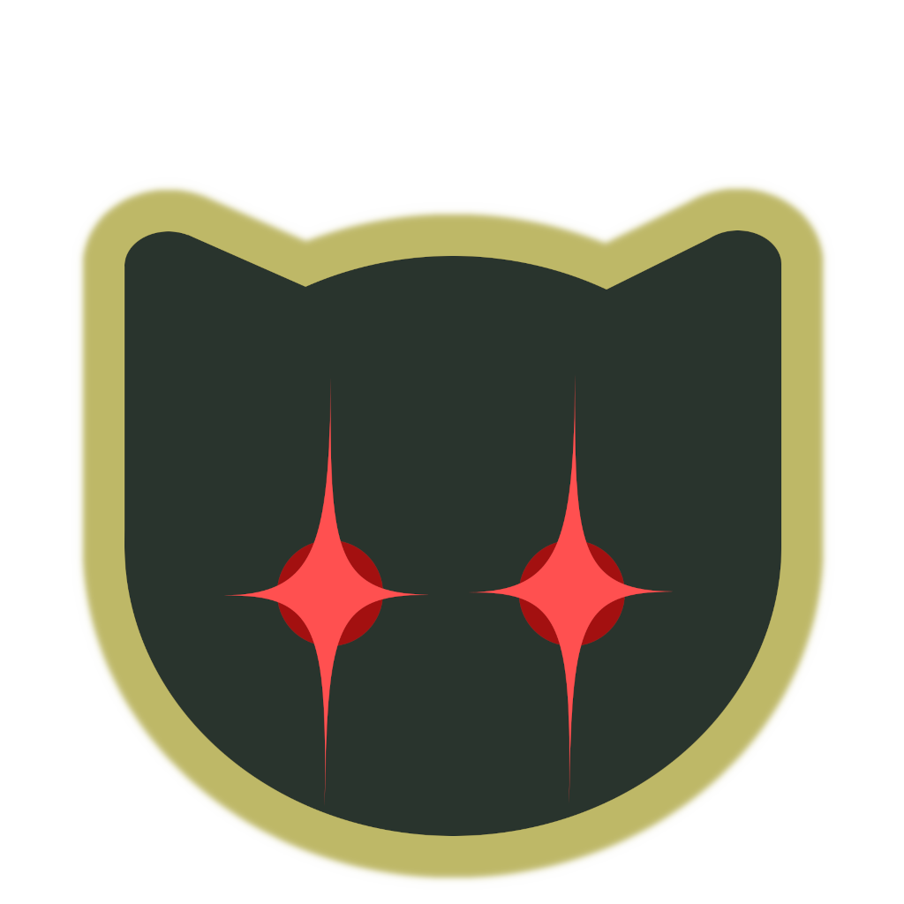

# SCHS Robotics Roles Bot

A Python-based Discord bot that automates updating user roles on Sage Creek High
School's SCHS Robotics server for the following FIRST Robotics FTC teams:
*   8097 Botcats
*   9267 Level Up
*   10809 Crow Force
*   15097 Python
*   23997 Catalysts



Development is hosted at [GitHub.com/jabernat/SCHS-Robotics-Roles-Bot](
https://github.com/jabernat/SCHS-Robotics-Roles-Bot ).


## Setup

### Profile Creation

A bot profile for the SCHS Robotics server named `@SCHS-Robotics-Roles-Bot` has
already been created on the [Discord Developers Portal](
https://discord.com/developers/applications/1158245940516364308/ ), giving this
script an identity for users to interact with.  If you are modifying this script
for your own server, follow the start of [Discord's app creation guide](
https://discord.com/developers/docs/getting-started ) to creating your own
bot profile. This bot profile was configured with the following settings:

*   Public Bot: `false` so that only the bot profile's creator can invite it to
    servers.

*   Privileged Gateway Intents: `GUILD_MEMBERS` (AKA "server members")

    This is required for the bot to request a complete listing of the server's
    users when reading and writing roles and display names.

### Invitation

With a bot profile created, it must be invited to your Discord server by
following the URL generated by the [Developer Portal's OAuth2 URL Generator](
https://discord.com/developers/applications/1158245940516364308/oauth2/url-generator
).  When generating `@SCHS-Robotics-Roles-Bot`'s invitation link, the following
settings were used:

*   OAuth2 Scopes:
    *   `bot`: Allows the bot to appear in the users list and interact with
        users.
    *   `applications.commands`: Lets the bot respond to slash commands like
        `/backup`.

*   Permissions:
    *   `ATTACH_FILES`: Required to attach backup files to command responses
         during `/backup` and `/apply`.
    *   `MANAGE_NICKNAMES`: Required to modify the display names of users during
        `/apply` and `/restore`.
    *   `MANAGE_ROLES` (AKA "Manage Permissions"): Required to add and remove
        users' roles during `/apply` and `/restore`.

The generated URL was [further customized](
https://discord.com/developers/docs/topics/oauth2#bot-vs-user-accounts ) to only
allow invitation to the SCHS Robotics server, resulting in this final invitation
link:
>   [`https://discord.com/api/oauth2/authorize`<br>
>   `?client_id=1158245940516364308`<br>
>   `&scope=applications.commands%20bot`<br>
>   `&permissions=402685952`<br>
>   `&guild_id=177211185177821184`<br>
>   `&disable_guild_select=true`](
>   https://discord.com/api/oauth2/authorize?client_id=1158245940516364308&scope=applications.commands%20bot&permissions=402685952&guild_id=177211185177821184&disable_guild_select=true
>   )

Following that link and accepting its confirmations will allow the bot profile
to join the server.

### Server Configuration

After the bot profile has joined the server, its name appears as a new role in
the server's settings page.  The permissions for bot actions have [complicated
interplay](
https://discord.com/developers/docs/topics/permissions#permission-hierarchy )
with the ordering of roles in the server's settings page.  In short, the bot's
new role should be reordered to between roles that should and shouldn't be
affected by the bot; Administrator and mentor roles should come before it, and
team roles, `@Active`, and `@Alumni` should come after it.

To limit the bot's interaction to certain channels or to certain roles, use the
server's "Integrations" settings page.


## Commands

Once the script logs in, the bot will appear online in the server and accept
commands from users with role and nickname management permissions.  The bot
accepts the following slash commands.

> **Warning**: Care must be taken not to manually update user roles during any
> of these commands.

### Command `/help`
Responds with information about this bot.

### Command `/backup`
Captures the role assignments of the server's users and responds with a
UTF8-encoded gzipped CSV file attachment structured as follows:

```csv
"Username","Display Name","Role 1 Name","Role 2 Name",…
"user_1","User One",1,0,…
"Usr2#1234","User Two",0,0,…
```

### Command `/restore`
Accepts a gzipped CSV file attachment in the same format as generated by
`/backup` or `/apply` and then attempts to revert user display names and roles
to that state.  Users and roles not present in the file are not affected.

### Command `/apply`
Applies user display-name and role changes from a simplified [mentor-accessible
Google Sheet](
https://docs.google.com/spreadsheets/d/12uITMXrY9U_Utq619Asrl-UaEYbTu896KDlj-u8ckMM/edit?usp=sharing
).  Administrator users are not affected.

1.  Update the spreadsheet's "Users" tab with student names, Discord usernames,
    and active teams.
    *   Rows with missing Discord usernames are ignored.
    *   Rows with no active teams will be transitioned to alumni if the
        corresponding student was previously a team member.
    *   Rows without a first name will not result in a Discord display-name
        change.

2.  Send the `/apply` command.

3.  Before any changes, the bot responds with a pre-update backup attachment
    like the `/backup` command.

4.  The bot applies updates to non-administrators based on spreadsheet contents
    as follows:
    *   If a student's first name is provided, their display names change to
        that plus a last initial if also provided.
    *   `@Active`: Students assigned to a team gain this role, and others lose
        it.
    *   `@Alumni`: Students assigned to a team lose this role.  If a student
        leaves a team and does not join another, then they gain this role.
    *   Team roles: Students assigned to a team gain its corresponding team role
        and lose all other team roles.
    *   Team alumni roles: Students removed from a team gain its corresponding
        team alumni role.

5.  Finally, the bot's response also includes a post-update backup attachment.


## Terms of Use

Backup CSV files generated by this bot must only be used for recovery
purposes by this same bot.  Server administrators should delete backup files
after their useful lifetime as they contain Discord handles, first names, and
last initials.  Scraping this data from Discord servers for purposes other than
interaction with this bot is against [the Discord Terms of Service](
https://discord.com/terms ).


## Privacy Policy

This bot does not persist any user data, and only uploads its backup files to
the Discord channel where they were requested.  No data is shared with third
parties.  Because this bot is not operated by a for-profit company, it is exempt
from the California Consumer Privacy Act (CCPA).
